<h3>𝙷𝚒 𝚝𝚑𝚎𝚛𝚎, 𝙸'𝚖 𝙳𝚊𝚗𝚒𝚎𝚕!👋</h3>

 

<i><a href="https://shevtsod.com" target="_blank">𝚜𝚑𝚎𝚟𝚝𝚜𝚘𝚍.𝚌𝚘𝚖</a></i>

### ❓ 𝙰 𝚋𝚒𝚝 𝚊𝚋𝚘𝚞𝚝 𝚖𝚎

- 🧑‍💻 𝙵𝚞𝚕𝚕-𝚜𝚝𝚊𝚌𝚔 𝚠𝚎𝚋 𝚍𝚎𝚟𝚎𝚕𝚘𝚙𝚎𝚛
- 🍁 𝙱𝚊𝚜𝚎𝚍 𝚒𝚗 𝚁𝚎𝚐𝚒𝚗𝚊, 𝚂𝚊𝚜𝚔𝚊𝚝𝚌𝚑𝚎𝚠𝚊𝚗, 𝙲𝚊𝚗𝚊𝚍𝚊
- 🧑‍🎓 𝙱.𝚂𝚌 (𝚂𝚘𝚏𝚝𝚠𝚊𝚛𝚎 𝚂𝚢𝚜𝚝𝚎𝚖𝚜 𝙴𝚗𝚐𝚒𝚗𝚎𝚎𝚛𝚒𝚗𝚐) @ 𝚄𝚗𝚒𝚟𝚎𝚛𝚜𝚒𝚝𝚢 𝚘𝚏 𝚁𝚎𝚐𝚒𝚗𝚊 (𝚐𝚛𝚊𝚍𝚞𝚊𝚝𝚎𝚍 𝟸0𝟸0)
- 🕹️ 𝙻𝚘𝚟𝚎𝚛 𝚘𝚏 𝙶𝙱𝙰-𝚎𝚛𝚊 𝚛𝚎𝚝𝚛𝚘 𝚐𝚛𝚊𝚙𝚑𝚒𝚌𝚜

### ⚙️ 𝚃𝚎𝚌𝚑𝚗𝚘𝚕𝚘𝚐𝚒𝚎𝚜 𝙸 𝚕𝚒𝚔𝚎

- 🐋 𝙳𝚘𝚌𝚔𝚎𝚛
- ⚛️ 𝚁𝚎𝚊𝚌𝚝 (+ 𝚅𝚒𝚝𝚎, 𝙽𝚎𝚡𝚝.𝚓𝚜, 𝙽𝚎𝚜𝚝𝙹𝚂)
- 📝 𝙹𝚊𝚟𝚊𝚂𝚌𝚛𝚒𝚙𝚝 (+ 𝚃𝚢𝚙𝚎𝚂𝚌𝚛𝚒𝚙𝚝, 𝙽𝚘𝚍𝚎.𝚓𝚜)
- 💽 𝙿𝚘𝚜𝚝𝚐𝚛𝚎𝚂𝚀𝙻 (+ 𝙿𝚛𝚒𝚜𝚖𝚊)

### 🛠️ 𝙲𝚞𝚛𝚛𝚎𝚗𝚝 𝚒𝚗𝚝𝚎𝚛𝚎𝚜𝚝𝚜 & 𝚙𝚛𝚘𝚓𝚎𝚌𝚝𝚜

- ⚓ 𝙻𝚎𝚊𝚛𝚗𝚒𝚗𝚐 𝙺𝚞𝚋𝚎𝚛𝚗𝚎𝚝𝚎𝚜 𝚊𝚝 𝚠𝚘𝚛𝚔!
- 🚧 𝙱𝚞𝚒𝚕𝚍𝚒𝚗𝚐 𝚖𝚢 [𝚙𝚎𝚛𝚜𝚘𝚗𝚊𝚕 𝚠𝚎𝚋𝚜𝚒𝚝𝚎](https://shevtsod.com)!
- 🎮 𝙿𝚕𝚊𝚢𝚒𝚗𝚐 𝚝𝚑𝚎 𝙼𝚎𝚐𝚊 𝙼𝚊𝚗 𝙱𝚊𝚝𝚝𝚕𝚎 𝙽𝚎𝚝𝚠𝚘𝚛𝚔 𝚜𝚎𝚛𝚒𝚎𝚜!

### 📊 𝙶𝚒𝚝𝙷𝚞𝚋 𝚜𝚝𝚊𝚝𝚜

